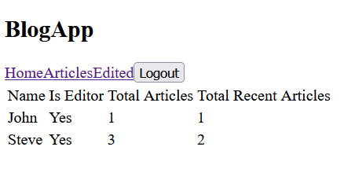
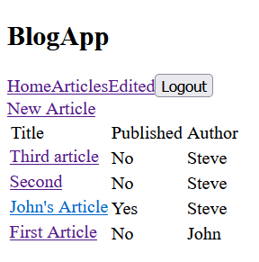
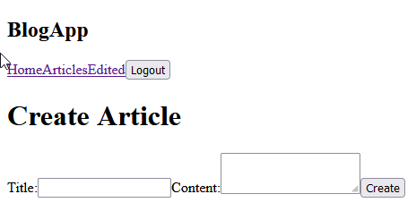
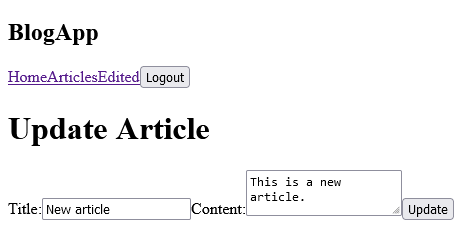
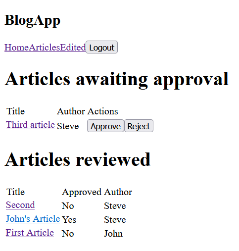

# Toy Project - Blog App

## Setup

```shell
make build
make up
```

## Requirements

* [x] Python 3 with Django 3.1 and Django Rest Framework
    * [x] Models
    * [x] Serializers
    * [x] Views
        * [x] Dashboard
        * [x] Article Writer ViewSet
        * [x] Article Editor ViewSet
    * [x] Test cases
* [x] flake8 linting
* [x] Docker
* [x] React

### Dashboard


### Article Listing


### Article Creation


### Article Update


### Article Approval

